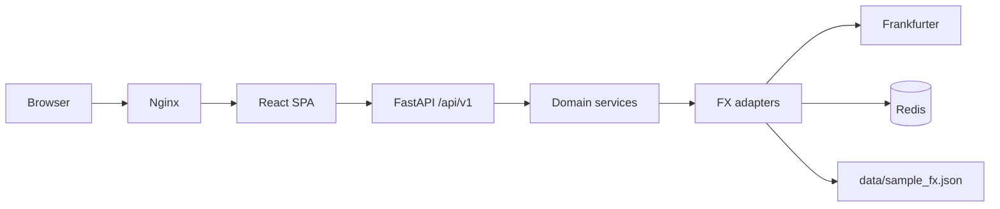

# FX Pulse — Currency Exchange Rate Dashboard

Professional EUR→USD analytics: versioned API, resilient data layer, React dashboard, Docker deployment, and full test/CI coverage.

**android-cursor ✅**

## Architecture



See [docs/ARCHITECTURE.md](docs/ARCHITECTURE.md) for layer details and ADRs.

## Quick start (Docker — requires Docker Desktop)

**Prerequisite:** Docker Desktop must be running on your machine.

```bash
docker compose up --build
```

- Dashboard: http://localhost:3000
- API: http://localhost:8000/docs

If you see `Cannot connect to the Docker daemon`, open **Docker Desktop** first and retry.

For development without Docker, use the local steps in [docs/DEPLOYMENT.md](docs/DEPLOYMENT.md).

## Local development

**Prerequisite:** Redis must be running. The API uses Redis for cache, rate limits, and the circuit breaker.

```bash
# Start Redis only (requires Docker Desktop)
docker compose up redis -d
# Or: brew services start redis
```

**Backend**

```bash
cd backend
python -m venv .venv && source .venv/bin/activate
pip install -r requirements-dev.txt
uvicorn app.main:app --reload --port 8000
```

**Frontend**

```bash
cd frontend
npm install
npm run dev
```

Open http://localhost:5173 — Vite proxies `/api` to the backend on port 8000.

See [docs/DEPLOYMENT.md](docs/DEPLOYMENT.md) for full local setup and troubleshooting.

## API authentication

The `/summary` endpoint requires an `X-API-Key` header. See `.env.example` for
how to generate and configure keys. Health and readiness endpoints are public.

## API examples

### Health (with timestamp)

```bash
curl http://localhost:8000/api/v1/health
```

```json
{
  "status": "ok",
  "timestamp": "2026-06-09T12:00:00+00:00",
  "version": "1.0.0",
  "uptime_seconds": 42.5
}
```

### Summary (daily breakdown)

```bash
curl -H "X-API-Key: dev-key-do-not-use-in-prod" \
  "http://localhost:8000/api/v1/summary?start=2026-06-03&end=2026-06-09&breakdown=day"
```

### Readiness (Redis + fallback file)

```bash
curl http://localhost:8000/api/v1/ready
```

Returns 503 if Redis is down or the offline sample file is missing. Use this before debugging summary errors.

## Resilience

Production deployments use **Redis** so cache, rate limits, and the circuit breaker are shared across all Uvicorn workers (`--workers 2` in the backend Dockerfile).

| Layer | Implementation |
|-------|----------------|
| Retry | Exponential backoff, 3 attempts (`FrankfurterAdapter`) |
| Cache | Redis TTL cache with transparent source labels (`CachedFxProvider`) |
| Circuit breaker | Redis-backed closed / open / half-open FSM (`RedisCircuitBreaker`) |
| Rate limit | Redis sliding window, 60 req/min/IP on `/api/v1/summary` |
| Offline fallback | `data/sample_fx.json` when Frankfurter unavailable |
| Metrics | Prometheus at `/metrics` |

**Source values:** `live`, `cache(live)`, `cache(offline)`, `offline_fallback`. The `"source"` field in JSON responses is metadata only—it does not change request routing.

## Testing

```bash
make check
```

Or run individually:

```bash
make backend-test
cd frontend && npm run test && npm run build
```

Backend coverage gate: **≥85%** (pytest-cov in CI).

## Deployment

See [docs/DEPLOYMENT.md](docs/DEPLOYMENT.md) for Render Blueprint steps.

## Compliance markers

- **android-cursor ✅** — this README
- **🍍 Pineapple** — dashboard footer

## Project layout

```
backend/          FastAPI API (clean architecture)
frontend/         React + Vite dashboard
data/             Offline fallback JSON
docs/             Architecture, deployment, operations, ADRs
.github/          CI pipeline
docker-compose.yml
render.yaml
```
